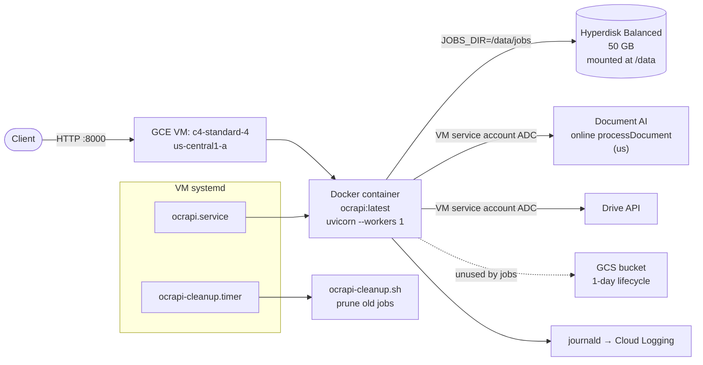

## What changed since the first deployment plan

The application no longer uses **ocrmypdf**, Ghostscript rasterization, or a large scratch volume. Async jobs now:

1. Split PDFs into byte-aware chunks (`ONLINE_CHUNK_PAGES`, `ONLINE_CHUNK_MAX_BYTES`)
2. Run concurrent **online** `processDocument` calls per chunk
3. Assemble searchable PDFs with **PyMuPDF** on the VM

Implications for infrastructure:

| Old plan | Current |
| -------- | ------- |
| `c4-standard-16`, 500 GB data disk | `c4-standard-4`, 50 GB data disk (input/output PDFs only) |
| `TMPDIR=/data/tmp` bind mount | Not needed — no page rasterization scratch |
| `OCRMYPDF_JOBS=8` tuning | `ONLINE_MAX_CONCURRENCY=8` per job |
| Caddy / HTTPS on 443 | Plain HTTP on 8000 (firewall-restricted); optional reverse proxy later |
| Concurrency driven by CPU × ocrmypdf jobs | Concurrency driven by Document AI **online pages/min** quota |

## Target architecture on GCP



## 1. Provision infrastructure (`deploy/gcp/01-provision.sh`)

Run from a dev machine with `gcloud` authenticated:

```bash
gcloud config set project YOUR_PROJECT
# Recommended for non-throwaway testing:
# APP_SOURCE_CIDR="203.0.113.4/32" bash deploy/gcp/01-provision.sh
bash deploy/gcp/01-provision.sh
```

Creates (idempotent):

- **Service account** `ocrapi-sa@PROJECT.iam.gserviceaccount.com` with `documentai.apiUser`, `artifactregistry.reader`, logging/monitoring writers
- **GCS bucket** `PROJECT-ocrapi-batch` with 1-day lifecycle (batch scratch; unused by current async pipeline)
- **Artifact Registry** repo `ocrapi` in `us-central1`
- **Firewall** `ocrapi-allow-http` (tcp:8000) and `ocrapi-allow-ssh` (tcp:22)
- **VM** `ocrapi-vm` — `c4-standard-4`, Ubuntu 24.04, 50 GB boot disk
- **Data disk** `ocrapi-data` — 50 GB Hyperdisk Balanced, attached to VM

Share the Drive folder with the printed service account email (Content Manager).

## 2. VM setup (`deploy/gcp/02-vm-setup.sh`)

On the VM as root:

```bash
sudo bash deploy/gcp/02-vm-setup.sh
```

- Formats/mounts data disk at `/data`, creates `/data/jobs`
- Installs Docker, configures Artifact Registry credential helper
- Installs `/etc/ocrapi.env` from `ocrapi.env.example` (review and edit)
- Installs `ocrapi.service` and `ocrapi-cleanup.timer`

## 3. Production environment (`/etc/ocrapi.env`)

Key values from [`deploy/gcp/ocrapi.env.example`](../../deploy/gcp/ocrapi.env.example):

```env
GCP_PROJECT_ID=YOUR_PROJECT
GCP_LOCATION=us
GCP_PROCESSOR_ID=YOUR_PROCESSOR_ID
GCS_BUCKET=YOUR_PROJECT-ocrapi-batch
DRIVE_SHARED_FOLDER_ID=YOUR_FOLDER_ID

MAX_UPLOAD_BYTES=734003200
MAX_PDF_PAGES=2000
SYNC_MAX_PAGES=15

ONLINE_CHUNK_PAGES=15
ONLINE_CHUNK_MAX_BYTES=18874368
ONLINE_MAX_CONCURRENCY=8

JOBS_DIR=/data/jobs
OCR_WORKER_CONCURRENCY=4

PDF_SAVE_INCREMENTAL=true
PDF_USE_TEXTWRITER=true
```

`GOOGLE_APPLICATION_CREDENTIALS` is intentionally unset — the attached VM service account is used via Application Default Credentials.

## 4. Build, push, and run

Dev machine:

```bash
bash deploy/gcp/03-build-and-push.sh
# copy the printed IMAGE=... line
```

VM:

```bash
sudo IMAGE=us-central1-docker.pkg.dev/PROJECT/ocrapi/ocrapi:TAG \
     bash deploy/gcp/04-run.sh
```

`ocrapi.service` runs:

```bash
docker run --rm --name ocrapi \
  --env-file /etc/ocrapi.env \
  -v /data/jobs:/data/jobs \
  -p 0.0.0.0:8000:8000 \
  ${IMAGE}
```

Health check: `curl http://EXTERNAL_IP:8000/healthz`

## 5. Concurrency and quota

The throughput ceiling is Document AI **online pages/min**, not VM CPU.

```
peak_online_calls  ≈ OCR_WORKER_CONCURRENCY × ONLINE_MAX_CONCURRENCY
peak_pages_per_min ≈ peak_online_calls × ONLINE_CHUNK_PAGES   (theoretical upper bound)
```

With defaults (`4 × 8 = 32` concurrent calls, 15 pages/chunk), theoretical peak ≈ 480 pages/min — but the ~120 pages/min sustained online quota is the real floor. See [`deploy/gcp/QUOTA.md`](../../deploy/gcp/QUOTA.md).

Signs you need a quota bump:

- `429 RESOURCE_EXHAUSTED` in `journalctl -u ocrapi.service`
- Jobs succeeding but taking far longer than `pages / 120` minutes

## 6. Day-2 operations

```bash
# Logs
sudo journalctl -u ocrapi.service -f

# Disk usage
df -h /data && du -sh /data/jobs

# Manual job cleanup (default 7 days)
sudo RETENTION_DAYS=3 /usr/local/bin/ocrapi-cleanup.sh

# Roll a new build
bash deploy/gcp/03-build-and-push.sh
sudo IMAGE=... bash deploy/gcp/04-run.sh
```

## 7. Optional hardening (not in current scripts)

- **HTTPS**: put Caddy, nginx, or a GCP HTTPS Load Balancer in front; bind container to `127.0.0.1:8000`
- **Firewall**: set `APP_SOURCE_CIDR` to your office IP before re-running `01-provision.sh`
- **Larger data disk**: increase `DATA_DISK_SIZE` in `01-provision.sh` if retaining many large job outputs
- **Batch OCR**: enable `_run_batch_ocr_sync` path for very large PDFs (requires GCS staging refactor in app code)
