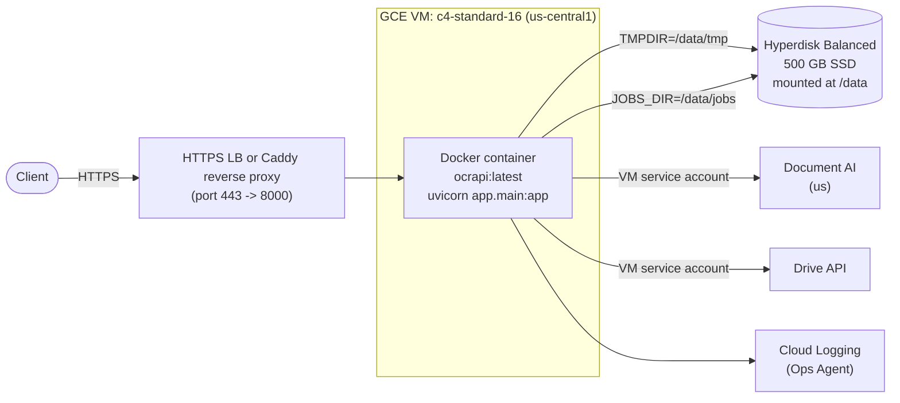

## Why you hit `[Errno 28]`

`ocrmypdf` rasterizes every page at 300 DPI via Ghostscript into the system temp dir (and `JOBS_DIR`). At your current limits (`MAX_UPLOAD_BYTES=700MB`, `MAX_PDF_PAGES=2000`) with defaults `OCR_WORKER_CONCURRENCY=4 * OCRMYPDF_JOBS=20 = 80` effective workers in [`app/config.py`](app/config.py), the temp explosion easily exceeds 40 GB. The fix is (a) put the scratch and job dirs on a big disk, (b) cap concurrency to match real CPU + Document AI quota, (c) sweep old jobs.

## Target architecture on GCP



## 1. Provision GCE infrastructure

- **VM**: `c4-standard-16` (16 vCPU / 60 GB RAM) in `us-central1` to be co-located with the `us` Document AI multi-region (lowest latency). Ubuntu 24.04 LTS image. Boot disk 50 GB pd-balanced.
- **Data disk**: Hyperdisk Balanced 500 GB, mounted at `/data`. Holds `JOBS_DIR` and the OCR scratch dir.
- **Service account**: a dedicated GCE SA with `roles/documentai.apiUser` on the processor project and `roles/drive.file` (or share the Drive folder with this SA as Content Manager). Attach to the VM; remove the bundled `gcp-credentials.json` from the image.
- **Firewall**: open `tcp:443` only (and `22` for SSH from your IP). Do not expose `8000` directly.
- **Quota check (critical)**: in Document AI -> Quotas, raise the per-region online-process quota (default ~600 page-requests/min per processor). Without this, more parallelism just yields `RESOURCE_EXHAUSTED`.

One-shot setup commands the plan will produce:

```bash
gcloud compute instances create ocrapi-vm \
  --zone=us-central1-a --machine-type=c4-standard-16 \
  --image-family=ubuntu-2404-lts --image-project=ubuntu-os-cloud \
  --boot-disk-size=50GB --boot-disk-type=pd-balanced \
  --service-account=ocrapi-sa@PROJECT.iam.gserviceaccount.com \
  --scopes=cloud-platform --tags=ocrapi
gcloud compute disks create ocrapi-data --zone=us-central1-a \
  --size=500GB --type=hyperdisk-balanced
gcloud compute instances attach-disk ocrapi-vm --disk=ocrapi-data --zone=us-central1-a
```

Then on the VM: format the data disk as ext4, mount at `/data`, add to `/etc/fstab`, `mkdir -p /data/jobs /data/tmp`, install Docker.

## 2. Small code/config changes

These are the only repo edits needed; the application logic stays the same.

### 2a. Redirect ocrmypdf scratch to the data disk

`ocrmypdf` writes its scratch to `tempfile.gettempdir()`. The call in [`app/services/ocr_pipeline.py`](app/services/ocr_pipeline.py) doesn't override it:

```77:86:app/services/ocr_pipeline.py
        ocrmypdf.ocr(
            str(input_path),
            str(output_path),
            force_ocr=True,
            output_type=output_type or settings.default_output_type,
            progress_bar=settings.ocr_progress_logging,
            optimize=0,
            jobs=jobs if jobs is not None else settings.ocrmypdf_jobs,
            ocr_engine="documentai",
        )
```

Simplest fix: just set `TMPDIR=/data/tmp` as an environment variable in the container (Python's `tempfile` honors it, and ocrmypdf uses `tempfile`). No code change required.

### 2b. Update `Dockerfile` ([`Dockerfile`](Dockerfile))

- Drop `tesseract-ocr` and `tesseract-ocr-eng` (saves ~120 MB and confirms Document AI is the only OCR engine, as the README states).
- Keep `ghostscript`, `qpdf`, `pngquant`, `unpaper`.
- Run uvicorn with multiple workers? No — keep `--workers 1`. The JobManager is in-process and uses an in-process asyncio queue; running multiple uvicorn workers would create separate job queues per process and break the worker pool. Concurrency is achieved via `OCR_WORKER_CONCURRENCY * OCRMYPDF_JOBS`, not uvicorn workers.

### 2c. Production `.env` on the VM

```env
GCP_PROJECT_ID=anda-dev-457721
GCP_LOCATION=us
GCP_PROCESSOR_ID=bdc855592c76c7c
# GOOGLE_APPLICATION_CREDENTIALS unset -> google-auth uses VM SA via ADC
DRIVE_SHARED_FOLDER_ID=1fh9BC3leRRMUIcwPrTJETtKTjLfA4MpZ

MAX_UPLOAD_BYTES=734003200
MAX_PDF_PAGES=2000

# Concurrency tuned for c4-standard-16 + Document AI quota
OCR_WORKER_CONCURRENCY=4
OCRMYPDF_JOBS=8
# total effective page workers = 32 (2x vCPU). Network-bound on DocAI so overcommit is fine.

DEFAULT_OUTPUT_TYPE=pdf
JOBS_DIR=/data/jobs
LOG_LEVEL=INFO
```

The `DocumentAIClient` in [`ocr_documentai_plugin/documentai_client.py`](ocr_documentai_plugin/documentai_client.py) only sets the env var when a path is configured, so leaving `GOOGLE_APPLICATION_CREDENTIALS` unset cleanly falls back to Application Default Credentials (the attached VM service account).

### 2d. Add a job-folder retention sweep

The README notes job folders are not auto-deleted. Add a tiny systemd timer on the VM (no app code change) that runs daily:

```bash
find /data/jobs -mindepth 1 -maxdepth 1 -type d -mtime +7 -exec rm -rf {} +
```

Optional later: add a `JOBS_RETENTION_DAYS` setting and an in-app background task in `JobManager.start()`.

## 3. Run the container

Build & push to Artifact Registry, then on the VM:

```bash
docker run -d --name ocrapi --restart=unless-stopped \
  --env-file /etc/ocrapi.env \
  -e TMPDIR=/data/tmp \
  -v /data/jobs:/data/jobs \
  -v /data/tmp:/data/tmp \
  -p 8000:8000 \
  us-central1-docker.pkg.dev/PROJECT/ocrapi/ocrapi:latest
```

Front it with **Caddy** (one-liner auto-HTTPS) on the same VM, or with a GCP HTTPS Load Balancer + managed cert if you want a static IP and CDN.

## 4. Concurrency / performance reasoning

- **CPU budget**: c4-standard-16 = 16 vCPU. Ghostscript rasterization is the only CPU-heavy local step; everything else is HTTPS round-trips to Document AI.
- **Recommended setting**: `OCR_WORKER_CONCURRENCY=4`, `OCRMYPDF_JOBS=8` = 32 page workers. Because per-page time is dominated by Document AI latency (~1-3s), 2x oversubscription vs. vCPUs maximizes throughput without saturating CPU.
- **RAM budget**: ~300-500 MB per page worker peak -> ~16 GB peak, well within 60 GB.
- **Disk budget**: 500 GB Hyperdisk handles 4 concurrent 700 MB PDFs (~20x rasterization expansion = ~56 GB peak) with room for kept job outputs and the daily sweep.
- **Document AI is the real ceiling**: with default quotas, ~10 pages/sec is typical. Request a quota increase before pushing concurrency higher than the above.

## 5. Optional next-step optimizations (not in this plan)

If after the above you want more speed, the highest-leverage follow-ups are:

- **Document AI batch processing** (`batch_process_documents` -> GCS) instead of per-page online calls. Best for large PDFs; needs a refactor of [`ocr_documentai_plugin/engine.py`](ocr_documentai_plugin/engine.py) and an intermediate GCS staging bucket.
- **Lower rasterization DPI** (e.g. 200 DPI) by passing `image_dpi=200` to ocrmypdf in [`app/services/ocr_pipeline.py`](app/services/ocr_pipeline.py); cuts scratch size ~2.25x and CPU time roughly in half, with some quality tradeoff.
- **GCS-backed job store** to move off VM disk entirely (only needed if you ever go multi-instance).