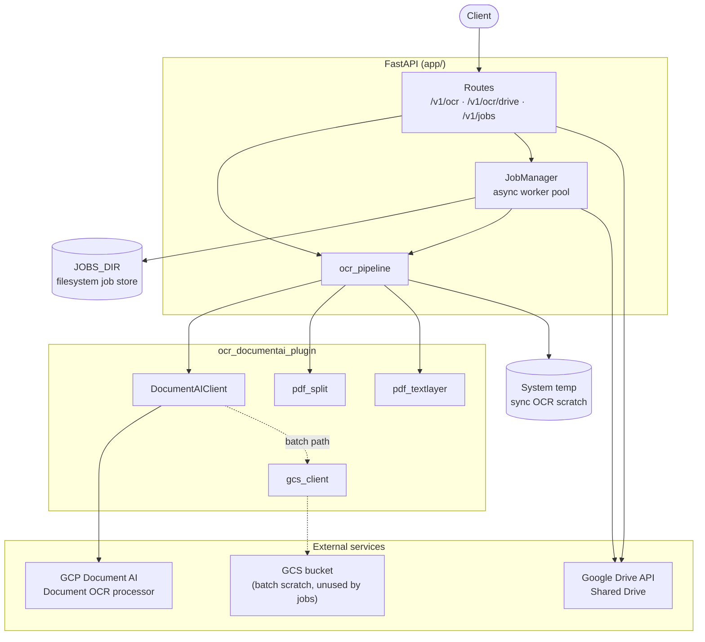
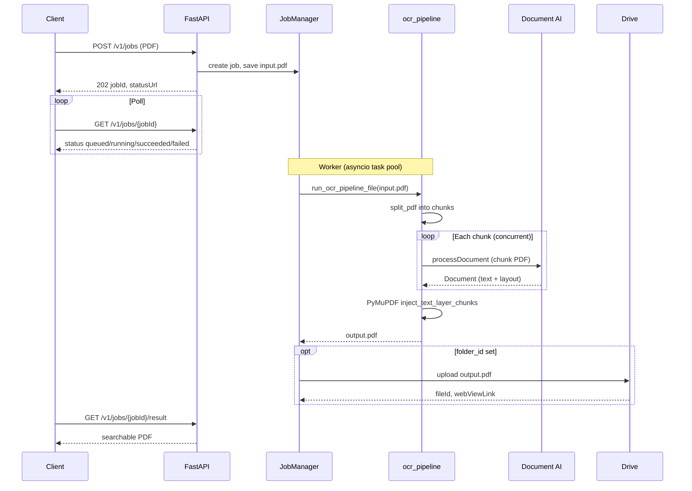

# DocAI OCR API

REST API that accepts a PDF and returns a searchable PDF using **GCP Document AI** for OCR and **PyMuPDF** for invisible text-layer injection.

## Features

- `POST /v1/jobs` — submit a PDF for async OCR (recommended for large documents)
- `GET /v1/jobs/{jobId}` — poll job status
- `GET /v1/jobs/{jobId}/result` — download searchable PDF when ready
- `POST /v1/jobs/{jobId}/drive` — upload a finished job's result to Google Drive
- `POST /v1/ocr` — upload a PDF, receive a searchable PDF synchronously (small docs only)
- `POST /v1/ocr/drive` — OCR a PDF and upload the result to a Google Drive Shared Drive
- Design-first OpenAPI contract at `/openapi.yml`

## Architecture

### Overview

The API is a **FastAPI** application that sends PDFs (or page chunks) to **GCP Document AI** via `processDocument` (online), then injects an invisible text layer with **PyMuPDF**. There is no local OCR engine (no Tesseract, Ghostscript, or ocrmypdf).



### Project layout

| Path | Role |
|------|------|
| `app/main.py` | Application entrypoint, lifespan hooks, OpenAPI/Swagger routes, global error handling |
| `app/config.py` | Pydantic settings loaded from `.env` (GCP, Drive, GCS, limits, concurrency) |
| `app/api/` | HTTP route handlers (`routes_ocr`, `routes_drive`, `routes_jobs`) and upload validation |
| `app/services/ocr_pipeline.py` | Validates PDFs, calls Document AI, injects text layer (sync or file-based for jobs) |
| `app/services/job_manager.py` | Async job queue, worker pool, on-disk job metadata and file I/O |
| `app/services/drive_client.py` | Uploads searchable PDFs to a Shared Drive folder via service account |
| `ocr_documentai_plugin/` | Document AI client, PDF splitting, PyMuPDF text-layer injection, GCS helpers |
| `openapi.yml` | Design-first API contract; served at `/openapi.yml` and `/openapi.json`, drives `/docs` |
| `deploy/gcp/` | Scripts and systemd units to run on a single GCE VM with Docker |

### Request paths

There are two ways to run OCR: **synchronous** (hold the HTTP connection) and **asynchronous** (job queue).

**Sync** (`POST /v1/ocr`, `POST /v1/ocr/drive`):

1. Upload is validated (PDF content type, size ≤ `MAX_UPLOAD_BYTES`).
2. PDF bytes are written to a temporary directory.
3. `ocr_pipeline.run_ocr_pipeline()` sends the whole PDF to Document AI online `processDocument` (page count ≤ `SYNC_MAX_PAGES`) in a thread pool (`asyncio.to_thread`).
4. PyMuPDF overlays invisible text from the Document AI layout onto the original pages.
5. For `/v1/ocr/drive`, the searchable PDF is uploaded to Drive (`folder_id` form field or `DRIVE_SHARED_FOLDER_ID` default).
6. Response is PDF bytes or Drive file metadata.

**Async** (`POST /v1/jobs` → poll → download):

1. A job folder is created under `JOBS_DIR/{jobId}/` with `meta.json`, and the upload is streamed to `input.pdf` (no full-file memory buffer).
2. The job is enqueued; the API returns `202` with a `statusUrl` immediately.
3. A background worker picks up the job, sets status to `running`, splits the PDF into byte-aware chunks, and runs concurrent online `processDocument` calls (`ONLINE_MAX_CONCURRENCY`) per chunk.
4. PyMuPDF overlays invisible text from all chunk results, writes `output.pdf`, and status becomes `succeeded`. Optional Drive upload runs after OCR; failure there is recorded in `driveUploadError` without changing job status to `failed`.
5. Client polls `GET /v1/jobs/{jobId}` and downloads via `GET /v1/jobs/{jobId}/result` when ready.



### OCR pipeline (how searchable PDFs are built)

1. **Validate** — page count and file size are checked against configured limits.
2. **Split (async only)** — `split_pdf` divides the PDF into chunks that fit online `processDocument` limits (`ONLINE_CHUNK_PAGES`, `ONLINE_CHUNK_MAX_BYTES`).
3. **OCR** — `DocumentAIClient.process_pdf_online` sends each PDF (whole file for sync, per chunk for async) to Document AI with retries on transient errors.
4. **Text layer** — `inject_text_layer` / `inject_text_layer_chunks` maps Document AI tokens onto the original PDF pages with PyMuPDF (`PDF_USE_TEXTWRITER`, `PDF_SAVE_INCREMENTAL` tune assembly performance).
5. **Output** — searchable PDF is written to disk or returned as bytes.

A GCS-backed **batch** code path exists (`batch_process_from_gcs`) for future use but is not used by the current async job pipeline.

### Job system

`JobManager` starts with the FastAPI lifespan and runs a bounded pool of asyncio worker tasks (`OCR_WORKER_CONCURRENCY`). Each worker processes one PDF at a time; within a PDF, chunk OCR runs in a `ThreadPoolExecutor` bounded by `ONLINE_MAX_CONCURRENCY`.

Job state is persisted as JSON on disk:

```
jobs/{jobId}/
  meta.json      # status, timestamps, pageCount, Drive fields, errors
  input.pdf      # uploaded source
  output.pdf     # searchable result (after success)
```

Statuses: `queued` → `running` → `succeeded` | `failed`. On restart, jobs left in `running` are re-queued as `queued`. Job folders are not auto-deleted in the app; use the deploy cleanup timer or a manual sweep.

### Google Drive integration

Drive uploads use the same service account as Document AI (JSON key locally via `GOOGLE_APPLICATION_CREDENTIALS`, or the attached VM service account via Application Default Credentials in production). The client uses the `drive.file` scope and `supportsAllDrives=True` for Shared Drive folders. Sync endpoints upload immediately after OCR; async jobs upload optionally when `folder_id` is provided on job creation.

### API contract and errors

The HTTP surface is defined in `openapi.yml` (design-first). FastAPI serves that spec directly rather than auto-generating it from route decorators. Swagger UI is at `/docs`; health check at `/healthz`.

Application errors map to [RFC 7807 Problem Details](https://datatracker.ietf.org/doc/html/rfc7807) (`application/problem+json`): validation (400), payload too large (413), bad PDF (422), not found (404), upstream/OCR failures (502). Each request gets an `X-Request-ID` header for log correlation.

### Concurrency and resources

Two layers of parallelism stack for async jobs:

| Layer | Setting | What it controls |
|-------|---------|------------------|
| Job workers | `OCR_WORKER_CONCURRENCY` | How many PDFs are OCR'd at once (async jobs) |
| Chunk workers | `ONLINE_MAX_CONCURRENCY` | How many online `processDocument` calls run in parallel per PDF |

Peak concurrent online calls ≈ `OCR_WORKER_CONCURRENCY × ONLINE_MAX_CONCURRENCY`.
The throughput ceiling is Document AI **online pages/min** quota (~120/min
sustained by default). See `deploy/gcp/QUOTA.md` before raising concurrency.

Disk usage is dominated by input/output PDFs under `JOBS_DIR`; there is no
per-page rasterization scratch.

## Prerequisites

1. **GCP**
   - Enable Document AI API
   - Create a **Document OCR** processor and note `processor_id` and `location`
   - Create a service account with `roles/documentai.apiUser`
   - Create a GCS bucket (required by config; used only if batch OCR is enabled)

2. **Google Drive**
   - Create or use a **Shared Drive** folder
   - Share the folder with the service account email (Content Manager)
   - Enable Google Drive API on the project

3. **Runtime**
   - Python 3.11+
   - No system OCR or PDF rasterization tools required (PyMuPDF and Document AI handle the pipeline)
   - Docker image is Python slim only (see `Dockerfile`)

## Setup

```bash
cp .env.example .env
# Edit .env with your values

pip install -e ".[dev]"
```

## Run locally

```bash
uvicorn app.main:app --host 0.0.0.0 --port 8000 --reload
```

Open Swagger UI at http://localhost:8000/docs

## Docker

```bash
docker build -t ocrapi .
docker run --env-file .env -p 8000:8000 ocrapi
```

## Deploy to GCP

See [`deploy/gcp/README.md`](deploy/gcp/README.md) for provisioning a single GCE VM with Docker, a data disk for `JOBS_DIR`, Artifact Registry, and systemd units.

## API usage

### Async OCR (large documents)

For PDFs with many pages (1000+), use the job API so the client does not hold a long HTTP connection:

```bash
# Submit job
curl -X POST http://localhost:8000/v1/jobs \
  -F "file=@large-document.pdf"

# Poll status (replace JOB_ID)
curl http://localhost:8000/v1/jobs/JOB_ID

# Download result when status is "succeeded"
curl -OJ http://localhost:8000/v1/jobs/JOB_ID/result
```

Optional: upload result to Google Drive on completion:

```bash
curl -X POST http://localhost:8000/v1/jobs \
  -F "file=@large-document.pdf" \
  -F "filename=searchable-document.pdf" \
  -F "folder_id=YOUR_SHARED_DRIVE_FOLDER_ID"
```

Or upload after the job succeeds (omit `folderId` to use `DRIVE_SHARED_FOLDER_ID`):

```bash
curl -X POST http://localhost:8000/v1/jobs/JOB_ID/drive \
  -H "Content-Type: application/json" \
  -d '{"folderId": "YOUR_SHARED_DRIVE_FOLDER_ID", "filename": "searchable-document.pdf"}'

curl -X POST http://localhost:8000/v1/jobs/JOB_ID/drive \
  -H "Content-Type: application/json" \
  -d '{}'
```

### Sync OCR (small documents)

For quick tests or small PDFs (up to `SYNC_MAX_PAGES`, default 15):

```bash
curl -X POST http://localhost:8000/v1/ocr \
  -F "file=@document.pdf" \
  -o searchable.pdf

curl -X POST http://localhost:8000/v1/ocr/drive \
  -F "file=@document.pdf" \
  -F "filename=searchable-document.pdf" \
  -F "folder_id=YOUR_SHARED_DRIVE_FOLDER_ID"
```

## Configuration

| Variable | Default | Description |
|----------|---------|-------------|
| `GCP_PROJECT_ID` | — | GCP project containing the Document AI processor |
| `GCP_LOCATION` | `us` | Document AI processor location |
| `GCP_PROCESSOR_ID` | — | Document OCR processor ID |
| `GOOGLE_APPLICATION_CREDENTIALS` | — | Path to service account JSON (optional on GCE; uses VM SA via ADC) |
| `GCS_BUCKET` | — | GCS bucket for batch OCR scratch (unused by current async jobs) |
| `BATCH_TIMEOUT_SECONDS` | `1800` | Timeout for batch OCR LRO polling |
| `BATCH_POLL_INTERVAL_SECONDS` | `10` | Poll interval for batch OCR |
| `DRIVE_SHARED_FOLDER_ID` | — | Optional default Shared Drive folder for `/v1/ocr/drive` and `/v1/jobs/{jobId}/drive` when folder ID is omitted |
| `MAX_UPLOAD_BYTES` | `629145600` (600 MB) | Maximum upload size for job and sync endpoints |
| `MAX_PDF_PAGES` | `2000` | Maximum pages for async job processing |
| `SYNC_MAX_PAGES` | `15` | Maximum pages for sync `/v1/ocr` and `/v1/ocr/drive` |
| `ONLINE_CHUNK_PAGES` | `15` | Maximum pages per online OCR chunk (async jobs) |
| `ONLINE_CHUNK_MAX_BYTES` | `18874368` (18 MB) | Maximum bytes per online OCR chunk |
| `ONLINE_MAX_CONCURRENCY` | `8` | Concurrent online `processDocument` calls per async job |
| `PDF_SAVE_INCREMENTAL` | `true` | PyMuPDF incremental save when injecting text layer |
| `PDF_USE_TEXTWRITER` | `true` | PyMuPDF TextWriter for faster token injection |
| `JOBS_DIR` | `jobs` | Directory for job input/output files |
| `OCR_WORKER_CONCURRENCY` | `4` | Number of PDFs processed in parallel |

### Concurrency tuning

Peak online calls ≈ `OCR_WORKER_CONCURRENCY × ONLINE_MAX_CONCURRENCY`. Lower
`ONLINE_MAX_CONCURRENCY` if you see `429 RESOURCE_EXHAUSTED`; raise Document
AI online pages/min quota before increasing both knobs. See `deploy/gcp/QUOTA.md`.

### Disk space

Async jobs store `input.pdf` and `output.pdf` under `JOBS_DIR`. Plan retention
for large uploads (e.g. 500 MB × concurrent jobs).

Job folders are not automatically deleted; plan a retention sweep for old jobs
or use the systemd timer in `deploy/gcp/`.

## Tests

```bash
pytest
```
